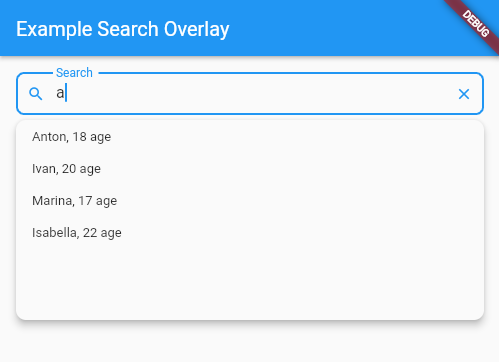

<!--
This README describes the package. If you publish this package to pub.dev,
this README's contents appear on the landing page for your package.

For information about how to write a good package README, see the guide for
[writing package pages](https://dart.dev/guides/libraries/writing-package-pages).

For general information about developing packages, see the Dart guide for
[creating packages](https://dart.dev/guides/libraries/create-library-packages)
and the Flutter guide for
[developing packages and plugins](https://flutter.dev/developing-packages).
-->
# Search Overlay

Simple search for Flutter app.



## Example

Here is a example on how to use this package.

If you want to take a deeper look at the example, take a look at the [example](https://github.com/Vafin84/search_overlay/tree/master/example) folder provided with the project.

```
SearchOverlay<User>(
          searchController: _searchController,
          elevation: 8,
          borderRadius: 10,
          offset: 5,
          decoration: InputDecoration(
            isDense: true,
            prefixIcon: const Icon(
              Icons.search,
            ),
            suffixIcon: IconButton(
                onPressed: () {
                  _searchController.clear();
                },
                splashRadius: 16,
                padding: EdgeInsets.zero,
                icon: const Icon(Icons.close)),
            border: const OutlineInputBorder(
                borderRadius: BorderRadius.all(Radius.circular(8.0))),
            labelText: "Search",
          ),
          items: _users
              .where((e) => e.name
                  .toLowerCase()
                  .contains(_searchController.text.toLowerCase()))
              .toList(),
          filterFn: (item) => "${item.name}${item.age}",
          displayItemFn: (item) {
            return ListTile(
              dense: true,
              visualDensity: const VisualDensity(vertical: -4),
              title: Text("${item.name}, ${item.age} age"),
              onTap: () {
                _displayUser(context, item);
                _searchController.clear();
              },
            );
          },
        ),

```        
